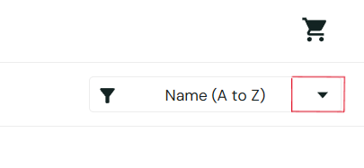

# BUG-001 — Sort Dropdown Arrow Does Not Open Sort Options

## Bug Information

| Field | Details |
|---|---|
| **Bug ID** | BUG-001 |
| **Bug Type** | Functional |
| **Severity** | Medium |
| **Priority** | Medium |
| **Status** | New |

## Environment

| Field | Details |
|---|---|
| **Operating System** | Windows 10 Home |
| **Browser** | Google Chrome 151.0.7922.77 |
| **Application** | SauceDemo |
| **URL** | https://www.saucedemo.com/ |

## Test Account

`standard_user`

## Preconditions

- User is logged in using the `standard_user` account.
- User is on the Products page.

## Steps to Reproduce

1. Log in using the `standard_user` account.
2. Navigate to the Products page.
3. Locate the sort dropdown at the top-right of the product list.
4. Click the down-arrow icon.

## Expected Result

The sort options dropdown should open.

## Actual Result

Nothing happens when the down-arrow icon is clicked.

The sort options can still be opened by clicking the **"Name (A to Z)"** text, but the down-arrow icon itself is not functional.

## User Impact

The arrow appears to be an interactive control but does not respond when clicked. This may confuse users who expect the arrow to open the sort options.

## Evidence

