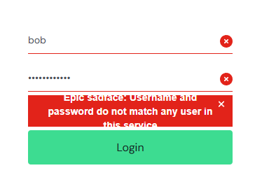

# BUG-002 — Invalid Credentials Error Message Text Is Clipped

## Bug Information

| Field | Details |
|---|---|
| **Bug ID** | BUG-002 |
| **Bug Type** | UI |
| **Severity** | Low |
| **Priority** | Low |
| **Status** | New |

## Environment

| Field | Details |
|---|---|
| **Operating System** | Windows 10 Home |
| **Browser** | Google Chrome 151.0.7922.138 |
| **Application** | SauceDemo |
| **URL** | https://www.saucedemo.com/ |

## Preconditions

- User is on the SauceDemo login page.

## Steps to Reproduce

1. Enter the username: `bob`
2. Enter the password: `secret_sauce`
3. Click the **Login** button.

## Expected Result

The invalid credentials error message is fully visible and readable.

## Actual Result

The invalid credentials error message is displayed and readable, but the text is clipped at the top and bottom.

## User Impact

The error message remains readable, but the clipped text may make parts of the message harder to read.

## Evidence

